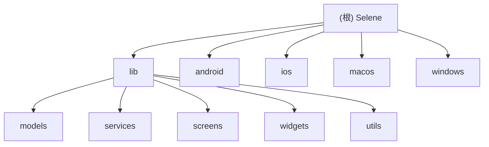

# Selene - Flutter 视频播放应用

## 变更记录 (Changelog)

### 2026-05-27 00:00:00
- TV 全屏播放器播放列表分组获焦即切换选集页，不再需要确认键；从选集行上下进入分组时保留分组行原横向位置，避免焦点上下移动时分组来回跳动。
- TV 全屏播放器底部菜单无操作自动隐藏时间调整为 5 秒；播放列表的选集行和分组行改为按真实控件贴左，并为分组行预留尾部滚动空间，避免分组左右键时焦点位置来回跳动。
- TV 详情页选集分组对齐选集列表的贴左浏览手感：切换分组后当前分组保持靠左，分组上键会回到该分组内就近选集，减少遥控器上下切换时的跳动感。
- TV 详情页预览播放器与 TV 全屏播放器新增自动下一集：当前视频播放完成后，若后续仍有剧集则自动切到下一集继续播放，并保持标题、选集状态和复用播放器壳同步更新。
- TV widget test 补齐自动下一集回归覆盖，同时让 `FontUtils` 在 `flutter test` 环境下回退本地 `TextStyle`，避免测试因 `google_fonts` 运行时拉网失败被误伤。
- TV 顶部右上角四个快捷入口全部调整为独立页面路由：搜索、播放历史、收藏夹、设置统一 `push` 新页，不再复用首页内部 tab 切页。
- 新增 `TvVideoLibraryScreen`、`TvHistoryScreen` 与 `TvFavoritesScreen`，把播放历史/收藏夹列表页从首页解耦为独立纵向 Grid 页面，返回后首页主分类焦点状态保持不变。
- TV 设置页服务器配置改为“仅保存配置，不立即登录”：保留原有服务器地址、账号、密码表单，但不再保存时直接发登录请求；同账号沿用现有 cookies，切换账号时清空旧 cookies，避免登录态串到新配置。

### 2026-05-26 00:00:00
- TV 继续观看播放记录链路对齐手机端：卡片回显当前集数、播放时间和源名，详情页按记录集数与秒数续播，详情页和全屏播放器进度变化都会保存播放记录。
- TV 换源记录保护对齐手机端：详情页和全屏播放器切换线路时保留当前集数与播放秒数，先保存新源记录，成功后才清理同影片其它源记录，避免网络抖动误删继续观看。
- TV 详情页加载链路对齐手机端播放器：入口精确源和标题补源并行启动，任一任务先拿到可播源就立即渲染详情并起播，后续线路通过增量回调继续去重追加，避免源数量多时长时间转圈。
- TV 顶部主菜单中的“直播”从过渡按钮调整为独立页面：进入后展示居中的“正在开发”占位内容，同时保留按上进入右上角快捷按钮区的焦点过渡体验。
- 修复 TV 顶部导航索引语义串用：直播页固定使用主菜单索引，播放历史/收藏夹/设置继续使用右上角快捷页索引，避免直播与播放历史选中态互相串扰。
- TV 首页“继续观看”的“查看更多”重新指向播放历史页，不再误跳到直播页。

### 2026-05-23 00:00:00
- TV 分类筛选面板的单个选项宽度进一步收窄到更短档位，并在每一行右侧贴边增加“仍有更多选项”的箭头提示，增强横向延伸感。
- TV 影视卡片与搜索推荐卡片的获焦整体放大比例从 `1.06` 再提升到 `1.08`，让遥控器停留态更明显。
- 修复 TV 顶部导航选中态串扰：播放历史、收藏夹、设置选中时不再把左侧“直播”菜单一并点亮，顶部回焦点也会优先回到对应快捷按钮。
- TV 纵向 Grid 改为固定每行 7 个卡片，TV 页面共用左右边距从 `72` 收敛到 `36`，让大屏列表横向展示更满。
- TV 分类筛选区新增双态展示：顶部获焦时展示更紧凑的完整四行筛选面板，焦点下移到分类 Grid 后自动收起为一行摘要，释放列表浏览高度；Grid 顶行按上会先把摘要态恢复为完整筛选面板。
- TV 设置页新增缓存管理区：展示当前缓存占用，支持一键清理业务运行缓存、图片磁盘缓存、临时目录、豆瓣缓存与 HLS 脚本缓存，同时保留服务器、账号、主题、弹幕和图片代理等配置。
- 新增应用启动前缓存整理：进入 App 前清理非配置类运行缓存和内存图片缓存；Android 端通过原生存储空间通道读取可用空间，低于 500MB 时清理图片磁盘缓存并停止写入新的图片磁盘缓存。
- TV 影视封面改为默认使用磁盘图片缓存，减少重复图片请求；低空间场景自动回退为不写入磁盘缓存。
- TV 影视卡片获焦后的整体放大比例从 `1.04` 调整为 `1.06`，让遥控器选中态更明显。
- TV 全屏播放改为独立大屏播放器壳：顶部返回图标和右上角图标仅作信息装饰，遥控器下键弹出底部一二级菜单，返回键先关闭菜单再退回详情页。
- TV 全屏播放器在底部菜单未弹出时支持遥控器确认键播放/暂停、左右键加速拖动进度，并在屏幕中心展示浅灰圆角时间提示与底部操作提醒。
- TV 全屏播放器菜单移除清晰度和内核入口，保留播放列表、播放线路、画面比例、倍速和其它入口；一级菜单获焦即切换二级菜单。
- TV 全屏播放器画面比例选项文案对齐手机端播放器设置，统一为适应、填充、宽度、高度。
- TV 电影、剧集、动漫、综艺分类页新增上键呼出的筛选面板，包含排序、类型、地区、年份四行横向筛选项，每行默认提供“全部”，呼出后焦点默认落到第一行“全部”。
- TV 分类筛选面板触发方式调整为顶部导航分类项获焦后按上键呼出，内容区上键不再直接呼出，先按正常焦点逻辑回到顶部导航。
- TV 分类筛选面板新增舒缓下滑展开动画：呼出时顶部导航淡出收起，筛选面板从顶部展开并把下方 Grid 卡片列表自然顶下去，返回键先关闭面板再恢复顶部导航。
- TV 分类页滚动遮挡优化：除首页外顶部导航增加半透黑色遮罩，筛选面板同样使用半透黑底，分类 Grid 内容区裁剪上溢海报，避免滚动时卡片压住菜单和筛选文字。
- TV 分类筛选面板每一行横向筛选项增加视口裁剪和首尾边界抖动，避免横向滚动时遮住左侧行标题，并防止长按左右键跳到其它筛选行。
- TV 分类筛选项按确认键后立即执行豆瓣推荐查询，并用筛选结果刷新下方分类 Grid。
- TV 顶部导航右上角新增搜索图标入口，遥控器确认后打开搜索页；搜索入口作为顶部导航内部焦点成员，筛选面板展开时随顶部导航一起隐藏。
- 新增 TV 搜索页：左侧提供搜索输入、字母数字遥控器键盘、清空和删除按钮，右侧顶部展示搜索历史纯文字 Grid 与 mock 搜索热词 Grid，下方展示影片推荐横向列表。
- TV 搜索页首屏布局上移：左侧搜索输入区和右侧搜索历史使用统一顶部留白，避免默认状态显得偏下。
- TV 搜索页影片推荐列表复用首页影视卡片放大比例，推荐横向列表到达右侧边界时支持遥控器边界抖动反馈。
- TV 焦点滚动动画增强：`TvFocusable` 获焦后自动把控件平滑滚动到视口偏上位置，首页横向分区使用更明显的区块级上移动画，设置页输入框接入同一套滚动辅助。
- TV 首页横向列表首尾方向键优先滚动到真实边界，完整露出首尾安全留白后才触发边界抖动，避免遥控器无法显示右侧空白区域。
- TV 顶部导航拆分为主分类和右上角快捷入口：左侧移除播放历史、收藏夹、设置，顶部第一行展示 IvyTV、右上角搜索/播放历史/收藏夹/设置四个带图标文字按钮和当前时间，主分类菜单独立放在下一行。
- TV 顶部主菜单新增直播过渡按钮：直播不呼出分类筛选，上键进入右上角搜索快捷入口；搜索快捷入口按下键回到直播，作为主菜单和右侧快捷区的焦点过渡。

### 2026-05-22 00:00:00
- 修复 TV 纯文字焦点列表在遥控器长按方向键时直接跳过中间选中态的问题：分类筛选、搜索历史/热词、设置页文字选项改为按列表分组节流重复方向事件，保留逐项经过的焦点动画；海报卡片、顶部导航与播放器菜单保持原有手感。
- 新增 Android TV 独立启动入口：Android 运行时通过原生设备能力判断电视设备，TV 端跳过登录直接进入独立 TV App Shell。
- 新增 `lib/tv_app/` TV 页面与组件模块，首页内容对齐普通端首页，但采用大屏横向区块、遥控器焦点卡片和 TV 专属导航。
- TV 设置页新增服务器地址、账号、密码与弹幕配置入口，复用普通端账号、服务器模式和弹幕设置存储。
- TV 影视卡片改为更紧凑的固定尺寸，降低封面纵向占用，便于大屏横向列表展示更多内容。
- TV 影视卡片焦点外框收敛到封面图区域，标题固定单行省略，封面恢复接近 2:3 的正常海报比例。
- TV 播放历史、收藏夹和分类页改为纵向 Grid 布局，支持上下滚动浏览，并为首尾列卡片预留焦点放大安全边距，首页内容区仍保持横向列表。
- TV 首页横向内容区每个分区最多展示 15 张影视卡，第 16 张为封面高度的“查看更多”卡片，点击后切到对应顶部分类页。
- TV 影视卡片点击后进入独立详情页：左侧嵌入无控制按钮组的播放器预览，播放器焦点确认仅用于进入全屏，右侧展示简介、全屏和收藏操作，下方依次提供横向换源、带分组标签的横向选集、相关推荐与居中的回到顶部；电视端不再显示页面级“返回上一级”按钮，直接依赖遥控器返回键返回上一页。
- 新增隐藏的强制 TV 模式代码开关，调试构建默认开启，便于在 BlueStacks、平板等非 TV 识别环境中调试 TV 版入口。
- TV 首页横向内容区在遥控器焦点离开后自动复位到列表开头，避免继续观看、热门电影等分区保留上一次横向滚动位置。
- TV 顶部导航新增电影、剧集、动漫、综艺四个大类入口，分类页复用现有首页数据并以纵向 Grid 展示。
- TV 设置页输入框改为浏览态与编辑态分离，焦点移入时不弹键盘，按确认后才进入编辑。
- TV 设置页新增图片代理选项，复用普通端豆瓣图片源配置，改善 TV 端影视封面加载成功率。
- TV 设置页新增主题色选项，当前支持默认 Ivy 绿和奈飞红，TV 顶部导航、卡片焦点、详情页按钮与设置控件统一读取 TV 主题色。
- TV 分类页、播放历史和收藏夹的二级标题改为跟随纵向列表滚动，仅顶部导航保持固定。
- TV 纵向 Grid 标题、空状态与首列卡片左边缘对齐，同时保留焦点安全边距，避免首尾列焦点放大被裁剪。
- TV 顶部导航新增外部进入焦点保护：从内容区回到顶部时先聚焦当前选中菜单项，避免按就近菜单误切页。
- TV 影视封面首次加载和网络加载中新增骨架屏，雨刷光带按左上到右下方向扫过。
- 新增 `.trellis/` 项目知识库，沉淀 Android TV 模式需求文档、前端实现规格和开发检查清单。
- 普通 Android 手机/平板、iOS、macOS、Windows 启动流程保持不变，继续走现有登录、本地模式与普通首页逻辑。
- Android 手机系统自动旋转关闭时，仅在播放器已处于全屏横屏后监听横向物理方向变化，并显示 2 秒自动隐藏的横屏侧切换按钮。
- 点击横屏提示按钮会把全屏播放器切到当前物理横屏侧，竖屏播放界面、播放器方向锁、短剧竖屏流与平板场景不显示该入口。
- Android 原生层新增物理方向传感器事件通道，Flutter 侧补充物理方向流映射与横屏提示策略回归测试。
- iOS 全屏横屏复用横屏侧切换提示：通过物理方向事件与当前界面方向差异推断系统是否已自动转屏，系统已转屏时不显示按钮，未转屏时保持 2 秒手动旋转入口。

### 2026-04-11 00:00:00
- 应用设置中的在线播放预加载改为“预加载级别”：提供 `关 / 低 / 中 / 高` 四档，分别对应 `0 / 1 / 3 / 5` 分钟前向预加载目标，默认保持高档。
- 全平台播放器统一读取新的预加载级别配置；在线播放仍会保留已观看片段的后向缓存窗口，减少向左拖动回看时重新回源的问题，本地离线播放仍不启用预加载。
- 补充预加载相关回归测试，覆盖旧布尔配置向新档位的兼容回退、WebView 预加载调优映射，以及设置页四档入口展示。
- 修复全平台手动匹配弹幕在自动下一集时丢失的问题：当用户手动选中某条连续弹幕结果后，会把该条目从当前集开始的后续集一并映射到后续视频集索引。
- 上述手动弹幕映射改为持久化保存，在线播放与本地离线播放在下次自动切集、重新进入播放页后都能继续沿用手动选择结果。
- 手动匹配面板选中回调补充所属条目与条目内集序信息，为后续集联动保存提供上下文。

### 2026-04-10 00:00:00
- 应用设置新增统一“预加载”开关，改为全平台可见的横向开/关单选，默认开启，并兼容旧的 macOS `media_kit` 预加载配置。
- 统一全平台在线播放预加载语义：Android、iOS、Windows 的 WebView 与 macOS `media_kit` 都会按当前位置右侧 5 分钟作为主动预加载目标，本地离线播放不受影响。
- 播放器浅色进度条改为展示“已确认缓存范围”，不再只限 macOS 预加载条；移动端与桌面端都会按当前缓存段绘制。
- WebView 在线播放新增实际 `buffered` 区间上报，并在开启预加载时提升前向缓冲与回看保留窗口，减少向左拖动时误判或丢失已缓内容的问题。

### 2026-04-07 00:00:00
- 修复播放器页面手动匹配弹幕搜索词缓存丢失问题：在点击下一集、换集或换源后，弹框输入框会优先回退到同一播放标题最近一次使用的搜索词。
- 保持原有按源/视频 ID/集索引保存的精确搜索词与手动匹配关系优先级不变，仅在当前上下文未命中时再走标题级回退。
- 修复移动端播放器中间 `+10s/-10s` 快捷跳转偶发错跳到旧位置附近的问题：为按钮 seek 的目标缓存补充兜底过期清理，避免长时间播放后继续复用过期的旧跳转点。
- 调整移动端播放器按钮组内进度条的透明可操作区域：在不改变轨道与圆点视觉样式的前提下，将命中高度从 24 提升到 36，改善拖动与点击手感。

### 2026-04-06 00:00:00
- 调整全平台手动匹配弹幕弹框的搜索词缓存时机：点击“搜索”后立即持久化当前输入内容，不再依赖后续选中某个弹幕结果。
- 新增手动匹配搜索词的独立保存方法，保持已选弹幕匹配关系与搜索词缓存解耦。
- 保持原有手动匹配成功后的保存逻辑不变，搜索为空结果或失败时也会保留用户刚输入的搜索词。

### 2026-04-04 00:30:00
- 调整播放器拖动进度条 seek 时的弹幕表现：seek 过程不再清屏，当前屏幕上的弹幕会自然滚出，目标位置的新弹幕直接接上。
- 保持切集、换源、首次加载弹幕和重新启用弹幕等内容切换场景的原有清屏逻辑不变，避免把 seek 连续性修复扩大到非目标路径。

### 2026-04-04 00:00:00
- 调整播放器弹幕暂停恢复行为：暂停后再播放时，保留当前屏幕上的弹幕继续滚动，不再先清屏再重建。
- 保持 seek、切集、换源等时间轴变化场景的原有弹幕重置逻辑不变，避免把本次修复扩大到非目标路径。

### 2026-04-01 00:00:00
- 新增播放器设置项“中间按钮跟随隐藏”，用于控制移动端中间三按钮是否与顶部/底部控制栏一起隐藏。
- 默认开启联动隐藏，保持控制层整体收起；关闭后在暂停状态下，中间三按钮可独立保留显示。
- 持久化该设置，确保用户下次进入播放器时沿用上次选择。
- 优化定时关闭移动端弹框交互：自定义分钟数与指定时间默认改为摘要展示，需点击“调整”后才展开滚轮，减少页面纵向滚动时误触时间滚轮的问题。
- 修复 iOS 手机与平板播放页长按倍速时弹幕“同步视频速度”未生效的问题：长按开始和结束现在都会走统一的倍速更新链路，确保弹幕速度与视频加速效果对齐安卓表现。
- 微调搜索页搜索历史布局：保留原有随文字长度变化的自然排布，仅轻微收紧词条内边距与项间距，减少右侧空白感而不破坏原有观感。

### 2026-03-31 00:30:00
- 下线播放器 backend benchmark 实验功能：移除用户菜单版本号长按入口，避免继续暴露非正式测试页面。
- 保留 benchmark 相关实现代码供后续参考，但从 `lib/` 与 `test/` 编译链路中移出，统一归档到 `archive/player_benchmark/`。
- 移除 benchmark 引入的 `fvp` 与 `video_player_platform_interface` 依赖，恢复正式应用依赖面。

### 2026-03-31 00:00:00
- 优化正式播放器 WebView seek 关键路径：手动拖动与控制层 seek 改为底层 seek 发起后再异步通知父层，减少正式页相对 benchmark 的额外同步开销。
- 弹幕 seek 跟随进一步异步化：将索引重置移出 seek 临界路径，并把弹幕索引定位改为二分查找，降低大弹幕列表下的 seek 收尾成本。

### 2026-03-30 00:00:00
- 新增隐藏的播放器后端 Seek Benchmark 实验页，可在同一设备上对比 `WebView / video_player / media_kit / fvp` 的 HLS 左向 seek 表现。
- 在用户菜单版本号区域新增长按入口，保持普通点击版本号跳转 GitHub 的现有行为不变。
- 新增 benchmark 计时模型、四后端 driver 封装与 `fvp`/官方 `video_player` 平台切换层，便于统一采集 seek API 返回、位置稳定与 buffering 清空耗时。

### 2026-03-23 00:00:00
- 播放器相关改动尽量回退到 `76c5abaf` 附近，仅保留移动端定时关闭功能。
- 移除息屏播放开关、相关设置持久化与提示文案，避免继续影响 Android PiP 与前后台切换链路。
- 恢复选集面板为旧版布局与交互表现，减少与 `76c5abaf` 的差异面。
- 保留定时关闭入口、快捷时长/指定时间设置，以及 Android 原生退出能力与 iOS 停止播放逻辑。
- 统一 iOS/Android 手机与平板在非全屏状态下的选集、换源、定时关闭、设置弹框为实色遮罩与不透明面板背景。

### 2026-03-22 23:26:36
- 新增移动端播放器定时关闭功能：支持 30/60/90/120 分钟快捷设置、指定时间点关闭与自定义分钟数。
- 新增息屏播放开关：在应用设置中控制 iOS/Android 锁屏后是否继续播放，便于配合定时关闭使用。
- Android 端补充原生退出能力：定时结束时优先尝试关闭应用；iOS 端受系统限制改为停止播放。
- 优化选集弹框自适应布局：根据标题长度动态调整弹框宽高，并按内容智能选择列数。
- 统一换集项悬浮态背景色：与换源面板保持一致。
- 调整播放器入口顺序：对调定时关闭与投屏按钮位置，统一移动端与短剧模式操作层级。
- 优化定时关闭收尾逻辑：触发后主动关闭 `wakelock_plus` 屏幕常亮，交还系统自动息屏。
- 修复 Android 画中画回归：进入 PiP 时不再被后台暂停逻辑误伤，返回播放页后可正常继续播放。
- 调整 Android 后台暂停策略：进入后台改为延迟判定，避免 PiP 切换瞬间误暂停导致灰屏。

### 2026-02-24 13:22:09
- 完成项目架构文档初始化
- 生成根级和模块级 AGENTS.md 文档
- 创建 Mermaid 模块结构图
- 建立模块间导航面包屑
- 生成 .Codex/index.json 索引文件

### 2026-01-12 18:45:00
- **新增 M3U8 下载功能**：支持分片并行下载、断点续传，并自动生成本地索引。
- **新增下载选集面板**：在播放页快速添加多个剧集到下载队列。
- **新增下载管理页面**：支持查看进度、暂停/恢复和删除任务。
- **集成入口**：在播放器选集区添加下载图标，在用户菜单添加管理入口。

### 2026-01-12 18:15:00
- 新增 M3U8 自动去广告功能：通过过滤 `#EXT-X-DISCONTINUITY` 标识减少插播广告。
- 完善播放设置持久化：新增自动去广告、系统时间显示、进度模式等字段的本地保存。
- 优化片头片尾显示格式：超过 60 秒自动转换为 `1m10s` 格式。
- 修复横竖屏切换时的 `RenderFlex` 溢出问题，增强顶栏约束稳定性。

### 2026-01-12 17:35:00
- 优化 `DanmakuSearchAnime` 模型：增加 `year` 字段及其自动从标题提取逻辑，支持结果按年份排序。
- 实现手动匹配弹幕弹框的年份正序/倒序切换功能。

### 2026-01-12 17:10:00
- 弹幕性能深度优化：引入 `RepaintBoundary` 隔离渲染压力，增加逻辑节流减少 CPU 占用，解决手机发烫和费电问题。
- 新增弹幕匹配状态提示：自动/手动匹配失败或空数据时通过 Toast 告知用户。
- 完善彩色弹幕屏蔽逻辑。

### 2026-01-12 16:55:00
- 弹幕功能重大更新：重构 `DanmakuSettingsPanel`，支持文字屏蔽按钮、防止重叠和速度同步
- 修复全屏弹幕消失问题：将弹幕层集成至 `VideoPlayerWidget` 内部
- 增强 `DanmakuSettings` 模型：新增缩放、行间距、防止重叠等字段
- 更新 widgets 和 screens 模块文档

### 2026-01-11 13:45:58
- 增量更新：新增 `player_settings_panel.dart` 组件
- 播放器功能增强：支持倍速播放和画面比例调整
- 更新 widgets 模块文档

---

## 项目愿景

Selene 是一个基于 Flutter 开发的跨平台视频播放应用，支持 Windows、macOS、Android、iOS 等多个平台。项目核心目标是提供流畅的视频播放体验，支持多源搜索、弹幕互动、离线下载、DLNA 投屏等功能。

核心特性：
- 多平台支持（Windows、macOS、Android、iOS）
- M3U8 流媒体播放与下载
- 弹幕系统（支持自动匹配、手动匹配、性能优化）
- 多源视频搜索与聚合
- 豆瓣电影信息集成
- 直播频道与 EPG 节目单
- DLNA 投屏功能
- 本地模式与服务器模式双模式运行

---

## 架构总览

Selene 采用经典的 Flutter 分层架构，遵循关注点分离原则：

```
lib/
├── main.dart              # 应用入口
├── models/                # 数据模型层
├── services/              # 业务逻辑层
├── screens/               # 页面层
├── widgets/               # UI 组件层
└── utils/                 # 工具函数层
```

技术栈：
- 框架：Flutter 3.4.3+
- 状态管理：Provider
- 网络请求：Dio、HTTP
- 视频播放：media_kit（桌面端）、video_player（移动端）
- 弹幕渲染：canvas_danmaku
- 本地存储：shared_preferences、path_provider
- 投屏：dlna_dart

---

## 模块结构图



---

## 模块索引

| 模块 | 路径 | 职责 | 文件数 | 文档 |
|------|------|------|--------|------|
| Models | `lib/models/` | 数据模型定义与序列化 | 14 | [查看](./lib/models/AGENTS.md) |
| Services | `lib/services/` | 业务逻辑与数据服务 | 20+ | [查看](./lib/services/AGENTS.md) |
| Screens | `lib/screens/` | 页面级组件 | 11 | [查看](./lib/screens/AGENTS.md) |
| Widgets | `lib/widgets/` | 可复用 UI 组件 | 40+ | [查看](./lib/widgets/AGENTS.md) |
| Utils | `lib/utils/` | 工具函数 | 3 | [查看](./lib/utils/AGENTS.md) |
| Android | `android/` | Android 平台配置 | - | [查看](./android/AGENTS.md) |
| iOS | `ios/` | iOS 平台配置 | - | [查看](./ios/AGENTS.md) |
| macOS | `macos/` | macOS 平台配置 | 4 Swift | - |
| Windows | `windows/` | Windows 平台配置 | 4 C++ | - |

---

## 运行与开发

### 环境要求

- Flutter SDK: >= 3.4.3
- Dart SDK: >= 3.4.3
- Android Studio / Xcode（移动端开发）
- Visual Studio 2022（Windows 开发）
- Xcode（macOS/iOS 开发）

### 快速启动

```bash
# 安装依赖
flutter pub get

# 运行（开发模式）
flutter run

# 构建 Windows 版本
flutter build windows

# 构建 macOS 版本
flutter build macos

# 构建 Android APK
flutter build apk

# 构建 iOS（需要 macOS）
flutter build ios
```

### 开发模式

应用支持两种运行模式：

1. 本地模式：数据存储在本地，无需服务器
2. 服务器模式：连接远程 API 服务器，支持多设备同步

切换方式：在登录页选择"本地模式"或输入服务器地址

---

## 测试策略

当前状态：无测试覆盖

建议测试策略：

1. 单元测试
   - Models 的序列化/反序列化
   - Services 的业务逻辑
   - Utils 的工具函数

2. Widget 测试
   - 关键 UI 组件的交互
   - 播放器控件的状态变化
   - 表单验证逻辑

3. 集成测试
   - 完整的用户流程（搜索 → 播放 → 收藏）
   - 下载功能端到端测试
   - 弹幕匹配与显示

4. 性能测试
   - 弹幕渲染性能
   - 大列表滚动性能
   - 内存泄漏检测

---

## 编码规范

### Dart 代码风格

遵循 [Effective Dart](https://dart.dev/guides/language/effective-dart) 规范：

- 使用 `lowerCamelCase` 命名变量和方法
- 使用 `UpperCamelCase` 命名类和枚举
- 使用 `snake_case` 命名文件
- 优先使用 `final` 而非 `var`
- 使用 `const` 构造函数优化性能

### 项目约定

- 每个模块必须有对应的 AGENTS.md 文档
- 新增功能需更新变更记录
- 复杂逻辑必须添加注释
- 避免在 Widget 中直接调用 API，使用 Service 层
- 使用 Provider 管理全局状态

### 文件组织

- Models：纯数据类，包含 `fromJson` 和 `toJson`
- Services：单例模式，提供静态方法
- Screens：页面级 Widget，管理页面状态
- Widgets：可复用组件，接收参数和回调
- Utils：纯函数，无副作用

---

## AI 使用指引

### 代码理解

1. 从 `main.dart` 开始了解应用启动流程
2. 查看 `lib/screens/` 了解页面结构
3. 查看 `lib/services/` 了解业务逻辑
4. 查看 `lib/models/` 了解数据结构

### 功能开发

1. 新增数据模型：在 `lib/models/` 创建，实现序列化
2. 新增业务逻辑：在 `lib/services/` 创建 Service 类
3. 新增页面：在 `lib/screens/` 创建 Screen Widget
4. 新增组件：在 `lib/widgets/` 创建可复用 Widget

### 问题排查

1. 播放器问题：检查 `video_player_widget.dart` 和 `player_adapter.dart`
2. 弹幕问题：检查 `danmaku_service.dart` 和 `danmaku_settings_panel.dart`
3. 下载问题：检查 `download_service.dart` 和 `m3u8_service.dart`
4. 网络问题：检查 `api_service.dart` 和 Dio 配置

### 性能优化

1. 弹幕性能：使用 `RepaintBoundary` 隔离渲染
2. 列表性能：使用 `ListView.builder` 懒加载
3. 图片加载：使用 `cached_network_image` 缓存
4. 状态管理：避免不必要的 `notifyListeners`

---

## 常见问题

### Q1: 如何添加新的视频源？

1. 在 `ApiService` 中添加新的搜索接口
2. 在 `SearchService` 中集成新源
3. 更新 `SearchResource` 模型
4. 在设置页面添加源配置

### Q2: 如何自定义播放器控件？

1. 修改 `pc_player_controls.dart`（桌面端）
2. 修改 `mobile_player_controls.dart`（移动端）
3. 在 `video_player_widget.dart` 中集成

### Q3: 如何调试弹幕匹配问题？

1. 检查 `DanmakuService.searchAnime` 的搜索结果
2. 查看 `getManualMatch` 的手动匹配记录
3. 使用 `debugPrint` 输出匹配日志

### Q4: 如何处理不同平台的差异？

1. 使用 `Platform.isXXX` 判断平台
2. 在 `main.dart` 中进行平台特定初始化
3. 使用条件编译（`kIsWeb`、`Platform.isAndroid` 等）

---

## 相关资源

- Flutter 官方文档：https://flutter.dev/docs
- Dart 语言指南：https://dart.dev/guides
- media_kit 文档：https://pub.dev/packages/media_kit
- canvas_danmaku 文档：https://pub.dev/packages/canvas_danmaku

---

最后更新：2026-02-24 13:22:09
