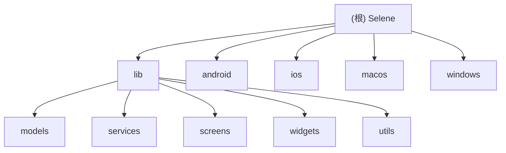

# Selene - Flutter 视频播放应用

## 变更记录 (Changelog)

### 2026-02-24 13:22:09
- 完成项目架构文档初始化
- 生成根级和模块级 CLAUDE.md 文档
- 创建 Mermaid 模块结构图
- 建立模块间导航面包屑
- 生成 .claude/index.json 索引文件

### 2026-01-12 18:45:00
- **新增 M3U8 下载功能**：支持分片并行下载、断点续传，并自动生成本地索引。
- **新增下载选集面板**：在播放页快速添加多个剧集到下载队列。
- **新增下载管理页面**：支持查看进度、暂停/恢复和删除任务。
- **集成入口**：在播放器选集区添加下载图标，在用户菜单添加管理入口。

### 2026-01-12 18:15:00
- 新增 M3U8 自动去广告功能：通过过滤 `#EXT-X-DISCONTINUITY` 标识减少插播广告。
- 完善播放设置持久化：新增自动去广告、系统时间显示、进度模式等字段的本地保存。
- 优化片头片尾显示格式：超过 60 秒自动转换为 `1m10s` 格式。
- 修复横竖屏切换时的 `RenderFlex` 溢出问题，增强顶栏约束稳定性。

### 2026-01-12 17:35:00
- 优化 `DanmakuSearchAnime` 模型：增加 `year` 字段及其自动从标题提取逻辑，支持结果按年份排序。
- 实现手动匹配弹幕弹框的年份正序/倒序切换功能。

### 2026-01-12 17:10:00
- 弹幕性能深度优化：引入 `RepaintBoundary` 隔离渲染压力，增加逻辑节流减少 CPU 占用，解决手机发烫和费电问题。
- 新增弹幕匹配状态提示：自动/手动匹配失败或空数据时通过 Toast 告知用户。
- 完善彩色弹幕屏蔽逻辑。

### 2026-01-12 16:55:00
- 弹幕功能重大更新：重构 `DanmakuSettingsPanel`，支持文字屏蔽按钮、防止重叠和速度同步
- 修复全屏弹幕消失问题：将弹幕层集成至 `VideoPlayerWidget` 内部
- 增强 `DanmakuSettings` 模型：新增缩放、行间距、防止重叠等字段
- 更新 widgets 和 screens 模块文档

### 2026-01-11 13:45:58
- 增量更新：新增 `player_settings_panel.dart` 组件
- 播放器功能增强：支持倍速播放和画面比例调整
- 更新 widgets 模块文档

---

## 项目愿景

Selene 是一个基于 Flutter 开发的跨平台视频播放应用，支持 Windows、macOS、Android、iOS 等多个平台。项目核心目标是提供流畅的视频播放体验，支持多源搜索、弹幕互动、离线下载、DLNA 投屏等功能。

核心特性：
- 多平台支持（Windows、macOS、Android、iOS）
- M3U8 流媒体播放与下载
- 弹幕系统（支持自动匹配、手动匹配、性能优化）
- 多源视频搜索与聚合
- 豆瓣电影信息集成
- 直播频道与 EPG 节目单
- DLNA 投屏功能
- 本地模式与服务器模式双模式运行

---

## 架构总览

Selene 采用经典的 Flutter 分层架构，遵循关注点分离原则：

```
lib/
├── main.dart              # 应用入口
├── models/                # 数据模型层
├── services/              # 业务逻辑层
├── screens/               # 页面层
├── widgets/               # UI 组件层
└── utils/                 # 工具函数层
```

技术栈：
- 框架：Flutter 3.4.3+
- 状态管理：Provider
- 网络请求：Dio、HTTP
- 视频播放：media_kit（桌面端）、video_player（移动端）
- 弹幕渲染：canvas_danmaku
- 本地存储：shared_preferences、path_provider
- 投屏：dlna_dart

---

## 模块结构图



---

## 模块索引

| 模块 | 路径 | 职责 | 文件数 | 文档 |
|------|------|------|--------|------|
| Models | `lib/models/` | 数据模型定义与序列化 | 14 | [查看](./lib/models/CLAUDE.md) |
| Services | `lib/services/` | 业务逻辑与数据服务 | 20+ | [查看](./lib/services/CLAUDE.md) |
| Screens | `lib/screens/` | 页面级组件 | 11 | [查看](./lib/screens/CLAUDE.md) |
| Widgets | `lib/widgets/` | 可复用 UI 组件 | 40+ | [查看](./lib/widgets/CLAUDE.md) |
| Utils | `lib/utils/` | 工具函数 | 3 | [查看](./lib/utils/CLAUDE.md) |
| Android | `android/` | Android 平台配置 | - | [查看](./android/CLAUDE.md) |
| iOS | `ios/` | iOS 平台配置 | - | [查看](./ios/CLAUDE.md) |
| macOS | `macos/` | macOS 平台配置 | 4 Swift | - |
| Windows | `windows/` | Windows 平台配置 | 4 C++ | - |

---

## 运行与开发

### 环境要求

- Flutter SDK: >= 3.4.3
- Dart SDK: >= 3.4.3
- Android Studio / Xcode（移动端开发）
- Visual Studio 2022（Windows 开发）
- Xcode（macOS/iOS 开发）

### 快速启动

```bash
# 安装依赖
flutter pub get

# 运行（开发模式）
flutter run

# 构建 Windows 版本
flutter build windows

# 构建 macOS 版本
flutter build macos

# 构建 Android APK
flutter build apk

# 构建 iOS（需要 macOS）
flutter build ios
```

### 开发模式

应用支持两种运行模式：

1. 本地模式：数据存储在本地，无需服务器
2. 服务器模式：连接远程 API 服务器，支持多设备同步

切换方式：在登录页选择"本地模式"或输入服务器地址

---

## 测试策略

当前状态：无测试覆盖

建议测试策略：

1. 单元测试
   - Models 的序列化/反序列化
   - Services 的业务逻辑
   - Utils 的工具函数

2. Widget 测试
   - 关键 UI 组件的交互
   - 播放器控件的状态变化
   - 表单验证逻辑

3. 集成测试
   - 完整的用户流程（搜索 → 播放 → 收藏）
   - 下载功能端到端测试
   - 弹幕匹配与显示

4. 性能测试
   - 弹幕渲染性能
   - 大列表滚动性能
   - 内存泄漏检测

---

## 编码规范

### Dart 代码风格

遵循 [Effective Dart](https://dart.dev/guides/language/effective-dart) 规范：

- 使用 `lowerCamelCase` 命名变量和方法
- 使用 `UpperCamelCase` 命名类和枚举
- 使用 `snake_case` 命名文件
- 优先使用 `final` 而非 `var`
- 使用 `const` 构造函数优化性能

### 项目约定

- 每个模块必须有对应的 CLAUDE.md 文档
- 新增功能需更新变更记录
- 复杂逻辑必须添加注释
- 避免在 Widget 中直接调用 API，使用 Service 层
- 使用 Provider 管理全局状态

### 文件组织

- Models：纯数据类，包含 `fromJson` 和 `toJson`
- Services：单例模式，提供静态方法
- Screens：页面级 Widget，管理页面状态
- Widgets：可复用组件，接收参数和回调
- Utils：纯函数，无副作用

---

## AI 使用指引

### 代码理解

1. 从 `main.dart` 开始了解应用启动流程
2. 查看 `lib/screens/` 了解页面结构
3. 查看 `lib/services/` 了解业务逻辑
4. 查看 `lib/models/` 了解数据结构

### 功能开发

1. 新增数据模型：在 `lib/models/` 创建，实现序列化
2. 新增业务逻辑：在 `lib/services/` 创建 Service 类
3. 新增页面：在 `lib/screens/` 创建 Screen Widget
4. 新增组件：在 `lib/widgets/` 创建可复用 Widget

### 问题排查

1. 播放器问题：检查 `video_player_widget.dart` 和 `player_adapter.dart`
2. 弹幕问题：检查 `danmaku_service.dart` 和 `danmaku_settings_panel.dart`
3. 下载问题：检查 `download_service.dart` 和 `m3u8_service.dart`
4. 网络问题：检查 `api_service.dart` 和 Dio 配置

### 性能优化

1. 弹幕性能：使用 `RepaintBoundary` 隔离渲染
2. 列表性能：使用 `ListView.builder` 懒加载
3. 图片加载：使用 `cached_network_image` 缓存
4. 状态管理：避免不必要的 `notifyListeners`

---

## 常见问题

### Q1: 如何添加新的视频源？

1. 在 `ApiService` 中添加新的搜索接口
2. 在 `SearchService` 中集成新源
3. 更新 `SearchResource` 模型
4. 在设置页面添加源配置

### Q2: 如何自定义播放器控件？

1. 修改 `pc_player_controls.dart`（桌面端）
2. 修改 `mobile_player_controls.dart`（移动端）
3. 在 `video_player_widget.dart` 中集成

### Q3: 如何调试弹幕匹配问题？

1. 检查 `DanmakuService.searchAnime` 的搜索结果
2. 查看 `getManualMatch` 的手动匹配记录
3. 使用 `debugPrint` 输出匹配日志

### Q4: 如何处理不同平台的差异？

1. 使用 `Platform.isXXX` 判断平台
2. 在 `main.dart` 中进行平台特定初始化
3. 使用条件编译（`kIsWeb`、`Platform.isAndroid` 等）

---

## 相关资源

- Flutter 官方文档：https://flutter.dev/docs
- Dart 语言指南：https://dart.dev/guides
- media_kit 文档：https://pub.dev/packages/media_kit
- canvas_danmaku 文档：https://pub.dev/packages/canvas_danmaku

---

最后更新：2026-02-24 13:22:09
