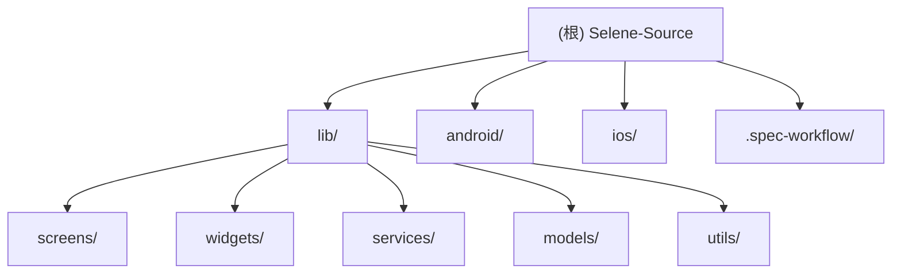

# Selene - Flutter 视频播放应用

## 变更记录 (Changelog)

### 2026-01-11 13:45:58
- 增量更新：新增 `player_settings_panel.dart` 组件
- 播放器功能增强：支持倍速播放和画面比例调整
- 更新 widgets 模块文档

### 2026-01-11 00:42:13
- 初始化 AI 上下文文档
- 完成项目结构分析和模块识别
- 生成根级和模块级文档

---

## 项目愿景

Selene 是一个基于 MoonTV 的跨平台视频播放应用，使用 Flutter 框架开发，支持 Android、iOS、macOS 和 Windows 平台。应用提供视频搜索、播放、收藏、历史记录等功能，支持本地模式和服务器模式两种运行方式。

**核心特性：**
- 跨平台支持（Android、iOS、macOS、Windows）
- 多源视频搜索与聚合
- 在线视频播放（支持 M3U8）
- 直播频道支持（IPTV）
- DLNA 投屏功能
- 画中画（PiP）模式
- 豆瓣电影信息集成
- 本地/服务器双模式运行
- 深色/浅色主题切换
- 倍速播放与画面比例调整

---

## 架构总览

Selene 采用经典的 Flutter 分层架构：

**技术栈：**
- Flutter SDK 3.4.3+
- Dart 语言
- Provider 状态管理
- media_kit 视频播放（桌面端）
- 原生播放器（移动端）

**架构层次：**
1. **展示层（Screens & Widgets）**：UI 组件和页面
2. **业务逻辑层（Services）**：API 调用、数据处理、缓存管理
3. **数据模型层（Models）**：数据结构定义
4. **工具层（Utils）**：通用工具函数
5. **平台层（Native）**：Android/iOS 原生代码

---

## 模块结构图



---

## 模块索引

| 模块路径 | 职责描述 | 语言 | 文件数 |
|---------|---------|------|-------|
| `lib/screens/` | 应用页面（登录、首页、播放器、搜索等） | Dart | 11 |
| `lib/widgets/` | 可复用 UI 组件（播放器控件、卡片、对话框等） | Dart | 40 |
| `lib/services/` | 业务逻辑服务（API、搜索、缓存、主题等） | Dart | 17 |
| `lib/models/` | 数据模型定义 | Dart | 14 |
| `lib/utils/` | 工具函数（设备检测、字体、图片处理） | Dart | 3 |
| `android/` | Android 原生模块 | Kotlin | 1 |
| `ios/` | iOS 原生模块 | Swift | 1 |
| `.spec-workflow/` | 文档模板工作流 | Markdown | 7 |

---

## 运行与开发

### 环境要求
- Flutter SDK 3.4.3 或更高版本
- Dart SDK（随 Flutter 安装）
- Android Studio / Xcode（用于移动端开发）
- Visual Studio（用于 Windows 开发）

### 快速启动

```bash
# 安装依赖
flutter pub get

# 运行应用（调试模式）
flutter run

# 运行在特定设备
flutter run -d <device_id>

# 查看可用设备
flutter devices
```

### 构建发布版本

项目提供了自动化构建脚本 `build.sh`：

```bash
# 构建所有平台（并行）
./build.sh

# 仅构建 Android
./build.sh --android-only

# 仅构建 iOS
./build.sh --ios-only

# 仅构建 macOS
./build.sh --macos-only

# 顺序构建（避免资源竞争）
./build.sh --sequential
```

构建产物将输出到 `dist/` 目录。

### 开发模式

```bash
# 热重载开发
flutter run

# 分析代码
flutter analyze

# 格式化代码
flutter format .
```

---

## 测试策略

**当前状态：** 项目暂无单元测试和集成测试。

**建议测试覆盖：**
1. **单元测试**：Services 层的业务逻辑（API 调用、数据解析）
2. **Widget 测试**：关键 UI 组件（播放器控件、搜索框）
3. **集成测试**：完整用户流程（登录 -> 搜索 -> 播放）

**测试命令：**
```bash
# 运行测试（待添加）
flutter test

# 生成覆盖率报告
flutter test --coverage
```

---

## 编码规范

### Dart 代码规范
- 遵循 [Effective Dart](https://dart.dev/guides/language/effective-dart) 指南
- 使用 `flutter_lints` 包进行静态分析
- 文件命名：小写下划线分隔（`snake_case`）
- 类命名：大驼峰（`PascalCase`）
- 变量/函数命名：小驼峰（`camelCase`）

### 项目约定
- **状态管理**：使用 Provider 进行全局状态管理
- **异步处理**：优先使用 `async/await`，避免回调地狱
- **错误处理**：使用 `try-catch` 捕获异常，提供友好错误提示
- **注释**：关键业务逻辑必须添加注释
- **国际化**：使用 `flutter_localizations` 支持多语言（已配置但未完全实现）

### 代码组织
```
lib/
├── main.dart              # 应用入口
├── screens/               # 页面
├── widgets/               # 可复用组件
├── services/              # 业务逻辑
├── models/                # 数据模型
└── utils/                 # 工具函数
```

---

## AI 使用指引

### 适合 AI 辅助的任务
1. **代码重构**：优化现有代码结构，提升可读性
2. **功能开发**：基于现有模式添加新功能（如新的视频源）
3. **Bug 修复**：分析错误日志，定位问题代码
4. **文档生成**：为函数/类添加注释和文档
5. **测试编写**：生成单元测试和 Widget 测试

### 关键上下文文件
- `lib/main.dart`：应用启动流程
- `lib/services/api_service.dart`：API 调用封装
- `lib/screens/player_screen.dart`：播放器核心逻辑
- `lib/services/search_service.dart`：搜索聚合逻辑
- `lib/widgets/player_settings_panel.dart`：播放器设置面板
- `pubspec.yaml`：依赖管理

### 常见开发场景

**场景 1：添加新的视频源**
1. 在 `lib/services/` 创建新的 Service 类
2. 实现搜索和解析接口
3. 在 `SearchService` 中注册新源
4. 更新 UI 显示新源数据

**场景 2：修改播放器 UI**
1. 定位到 `lib/widgets/pc_player_controls.dart` 或 `mobile_player_controls.dart`
2. 修改控件布局和交互逻辑
3. 测试不同屏幕尺寸和方向

**场景 3：优化缓存策略**
1. 查看 `lib/services/douban_cache_service.dart`
2. 调整缓存过期时间和清理策略
3. 测试内存和磁盘占用

**场景 4：添加播放器设置选项**
1. 修改 `lib/widgets/player_settings_panel.dart`
2. 添加新的设置项（如字幕、音轨选择）
3. 在播放器控件中集成设置回调

### 注意事项
- **不要修改**：`.gitignore` 中的忽略规则（除非必要）
- **谨慎修改**：原生代码（`android/`、`ios/`），可能影响平台兼容性
- **优先使用**：现有的 Service 和 Widget，避免重复造轮子
- **测试覆盖**：修改核心逻辑后，务必在多个平台测试

---

## 相关资源

- [Flutter 官方文档](https://flutter.dev/docs)
- [Dart 语言指南](https://dart.dev/guides)
- [Provider 状态管理](https://pub.dev/packages/provider)
- [media_kit 播放器](https://pub.dev/packages/media_kit)

---

**文档版本：** 1.1.0
**最后更新：** 2026-01-11
**维护者：** Selene 开发团队
