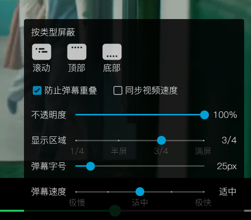

## 弹幕通过影视名字匹配接口
请求网址：（http://192.168.31.240:9321/12345687/ 是baseApi）
http://192.168.31.240:9321/12345687/api/v2/match
请求方法
POST
JSON参数：{"fileName":"十二封信 S1E1 @imgo"}
返回值示例：
{
    "errorCode": 0,
    "success": true,
    "errorMessage": "",
    "isMatched": true,
    "matches": [
        {
            "episodeId": 10095,
            "animeId": 302325,
            "animeTitle": "十二封信(2025)【电视剧】from 听风",
            "episodeTitle": "【qq】 第01集",
            "type": "电视剧",
            "typeDescription": "电视剧",
            "shift": 0,
            "imageUrl": "https://vcover-vt-pic.puui.qpic.cn/vcover_vt_pic/0/mzc00200fboxu3c1755830247189/350"
        }
    ]
}

## 弹幕数据请求根据弹幕id
请求网址：（http://192.168.31.240:9321/12345687/ 是baseApi，10095是弹幕id）
http://192.168.31.240:9321/12345687/api/v2/comment/10095?format=json
请求方法
GET
返回数据示例：（
实体介绍：属性 p 字段说明（8个字段，逗号分隔）：

时间：弹幕出现时间（秒）
类型：1=滚动, 4=底部, 5=顶部
字体：字体大小（25=中, 18=小）
颜色：RGB 转十进制（16777215=白色）
时间戳：Unix 时间戳（秒）
弹幕池：弹幕池编号（通常为0）
用户Hash：用户唯一标识（数字格式）
弹幕ID：弹幕唯一编号（11位数字）
）
{
  "count": 6712,
  "comments": [
    {
      "cid": 1,
      "p": "0.00,1,16733181,[qq]",
      "m": "唐亦寻，这是苦难的结束，是新的开始 x 3",
      "t": 0
    },
    {
      "cid": 2,
      "p": "0.00,1,16777215,[qq]",
      "m": "谁敢欺负我们阿寻！ x 3",
      "t": 0
    },
    {
      "cid": 3,
      "p": "0.00,1,16777215,[qq]",
      "m": "唐亦寻弹奏命运之弦，揭开尘封的真相 x 4",
      "t": 0
    }
}

帮我按照现有出色的弹幕库，帮我写一个弹幕组件，支持滚动、底部、顶部三种类型，支持字体大小、字体颜色、弹幕池、用户Hash、弹幕ID等属性。
集成到我现在这个项目中，支持在视频播放时显示弹幕，并可以配置一些参数，比如弹幕速度、弹幕透明度等。
我想要在user_menu.dart中添加一个设置baseApi的输入框，用户可以在其中输入自己的baseApi，然后点击确认保存。

